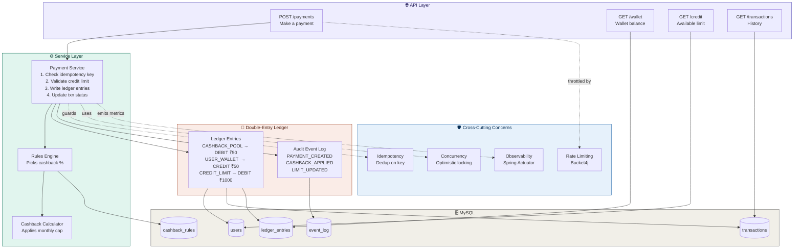

# Kiwi Credit & Cashback Engine

A production-grade backend system simulating the core of a UPI credit card fintech — credit limit management, double-entry ledger accounting, and a configurable cashback rules engine.

Built to demonstrate the real engineering patterns used by companies like Kiwi (gokiwi.in).

---

## Architecture



---

## Production-grade Features

| Feature | Implementation |
|---|---|
| **Double-entry ledger** | Every rupee movement creates two ledger rows — balances are derived, never stored |
| **Idempotency** | Unique key per request; duplicate requests return the original response, never double-charge |
| **Optimistic locking** | `@Version` on User entity prevents concurrent payments causing incorrect credit deductions |
| **Configurable rules engine** | Cashback % and monthly caps live in DB — change rates without redeploying |
| **Monthly cap enforcement** | Queries ledger entries to check how much cashback already earned this month |
| **Audit event log** | Immutable record of every system event with before/after snapshots |
| **Rate limiting** | Bucket4j in-memory rate limiter on the payments endpoint (10 req/min) |
| **Observability** | Spring Actuator exposes `/actuator/metrics`, `/actuator/health` |
| **Concurrency test** | 50 simultaneous payment threads — proves no lost updates via assertions |

---

## Tech Stack

- **Backend:** Java 17, Spring Boot 3.2, Spring Data JPA
- **Database:** MySQL 8
- **Rate limiting:** Bucket4j
- **Observability:** Spring Actuator
- **Frontend:** Vanilla HTML/CSS/JS (demo only)
- **Containerisation:** Docker + Docker Compose

---

## Database Schema

### `users`
| Column | Type | Notes |
|---|---|---|
| id | BIGINT PK | |
| name | VARCHAR | |
| email | VARCHAR UNIQUE | |
| credit_limit | DECIMAL(12,2) | Total card limit |
| used_credit | DECIMAL(12,2) | Amount consumed so far |
| version | BIGINT | Optimistic lock version |

### `transactions`
| Column | Type | Notes |
|---|---|---|
| id | BIGINT PK | |
| user_id | FK → users | |
| amount | DECIMAL(12,2) | |
| category | ENUM | GROCERY, FOOD, FUEL, TRAVEL… |
| payment_mode | ENUM | UPI_SCAN, UPI_ONLINE, ONLINE |
| status | ENUM | PENDING → SUCCESS / FAILED |
| cashback_earned | DECIMAL(12,2) | |
| idempotency_key | VARCHAR(64) UNIQUE | Client-supplied dedup key |

### `ledger_entries`
| Column | Type | Notes |
|---|---|---|
| id | BIGINT PK | |
| transaction_id | FK → transactions | |
| account_type | ENUM | USER_WALLET, CASHBACK_POOL, CREDIT_LIMIT |
| account_ref | VARCHAR | e.g. USER_1, SYSTEM |
| entry_type | ENUM | DEBIT / CREDIT |
| amount | DECIMAL(12,2) | |

### `cashback_rules`
| Column | Type | Notes |
|---|---|---|
| id | BIGINT PK | |
| category | ENUM | |
| payment_mode | ENUM | |
| percentage | DECIMAL(5,2) | e.g. 5.00 = 5% |
| monthly_cap | DECIMAL(10,2) | Max cashback per user/month |
| valid_from / valid_to | DATETIME | Rule validity window |

---

## Running Locally

### Option 1 — Docker (one command)
```bash
docker-compose up --build
```
App runs on `http://localhost:8080`, MySQL on `3306`.

### Option 2 — Manual
```bash
# Start MySQL
mysql -u root -p
CREATE DATABASE kiwi_engine;

# Run Spring Boot
cd backend
mvn spring-boot:run
```

### Frontend
Open `frontend/index.html` directly in your browser (no server needed).

---

## API Reference

### Make a payment
```
POST /api/payments
Content-Type: application/json

{
  "userId": 1,
  "amount": 1000,
  "category": "GROCERY",
  "paymentMode": "UPI_SCAN",
  "idempotencyKey": "unique-client-key-123"
}
```

**Response:**
```json
{
  "transactionId": 42,
  "amount": 1000.00,
  "cashbackEarned": 50.00,
  "walletBalance": 250.00,
  "availableCredit": 49000.00,
  "status": "SUCCESS",
  "idempotencyHit": false,
  "message": "Payment successful! ₹50.00 cashback earned."
}
```

### Get user summary
```
GET /api/users/{userId}
```

### Get ledger entries
```
GET /api/payments/ledger/{userId}
```

### Get audit log
```
GET /api/payments/audit/{userId}
```

### Health check
```
GET /actuator/health
```

---

## Cashback Rules (seeded on startup)

| Payment Mode | Cashback | Monthly Cap |
|---|---|---|
| UPI Scan-and-Pay | 5% | ₹500 |
| UPI Online | 2% | ₹300 |
| Online / Card | 1.5% | ₹200 |

Rules are stored in the `cashback_rules` table and can be updated without redeploying.

---

## Design Decisions

### Why double-entry ledger instead of a balance column?
A `wallet_balance` column updated via `UPDATE` is vulnerable to race conditions and gives no audit history. The double-entry approach inserts immutable rows — balances are derived by querying the ledger, which means they are self-verifying (all debits + credits across all accounts should sum to zero) and fully auditable.

### Why optimistic locking?
Credit limit deduction requires a read → check → write sequence. Without locking, two concurrent payments can both read the same balance, both pass the limit check, and both deduct — causing overdraft. Optimistic locking via `@Version` makes one of them fail with an `ObjectOptimisticLockingFailureException`, which Spring retries safely.

### Why idempotency keys?
UPI payments are retried by clients on network timeouts. Without deduplication, a timeout followed by a retry could double-charge the user. The client sends a unique key per payment intent; the server stores it and returns the original response on duplicates.

### Why a DB-driven rules engine?
Hardcoded `if-else` cashback logic means every promotional rate change requires a code deployment. Storing rules in `cashback_rules` with validity windows lets you update rates, launch limited-time promos, and A/B test cashback percentages via a simple DB update.

---

## Running the Concurrency Test
```bash
cd backend
mvn test -Dtest=ConcurrencyTest
```
Fires 50 simultaneous payment threads and asserts the final wallet balance and used credit are mathematically exact — proving no lost updates.
